# Exploring New Hampshire School Enrollment Data

``` r
library(nhschooldata)
library(dplyr)
library(ggplot2)
library(tidyr)
```

``` r
enr <- fetch_enr_multi(2012:2026, use_cache = TRUE)
```

## State enrollment trend

New Hampshire’s public school enrollment has declined steadily over the
past 14 years. The state lost over 30,000 students — a 16% drop — even
as charter schools expanded and PreK programs grew.

### 1. NH lost 30,000 students since 2012

State enrollment fell from 190,805 to 160,322 — a 16% decline driven by
demographic contraction in one of America’s oldest-population states.

``` r
state_trend <- enr |>
  filter(is_state, subgroup == "total_enrollment", grade_level == "TOTAL") |>
  select(end_year, n_students) |>
  arrange(end_year)

stopifnot(nrow(state_trend) > 0)

state_trend |>
  mutate(
    change = n_students - lag(n_students),
    cumulative_change = n_students - first(n_students)
  )
#>    end_year n_students change cumulative_change
#> 1      2012     190805     NA                 0
#> 2      2013     187962  -2843             -2843
#> 3      2014     185320  -2642             -5485
#> 4      2015     183604  -1716             -7201
#> 5      2016     181339  -2265             -9466
#> 6      2017     179734  -1605            -11071
#> 7      2018     178328  -1406            -12477
#> 8      2019     177365   -963            -13440
#> 9      2020     176168  -1197            -14637
#> 10     2021     167909  -8259            -22896
#> 11     2022     168620    711            -22185
#> 12     2023     167357  -1263            -23448
#> 13     2024     165082  -2275            -25723
#> 14     2025     162660  -2422            -28145
#> 15     2026     160322  -2338            -30483
```

``` r
ggplot(state_trend, aes(x = end_year, y = n_students)) +
  geom_line(linewidth = 1.2, color = "#1f77b4") +
  geom_point(size = 2, color = "#1f77b4") +
  scale_y_continuous(labels = scales::comma, limits = c(150000, 200000)) +
  scale_x_continuous(breaks = seq(2012, 2026, 2)) +
  labs(
    title = "New Hampshire Public School Enrollment, 2012-2026",
    subtitle = "Total enrollment declined 16% (-30,483 students)",
    x = "School Year (ending)",
    y = "Total Students",
    caption = "Source: NH DOE iPlatform"
  ) +
  theme_minimal(base_size = 13)
```

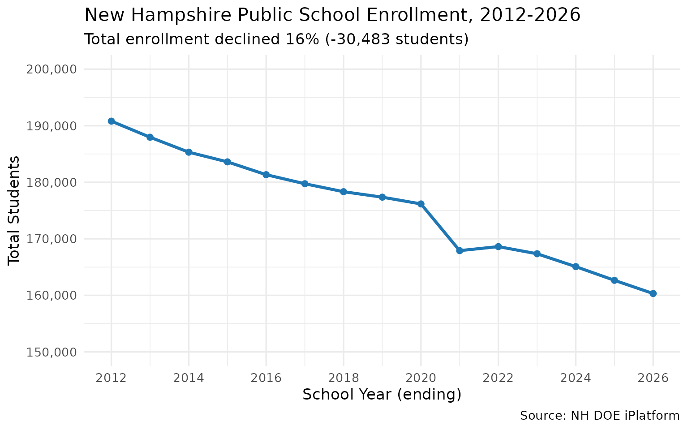

### 2. COVID erased 8,259 students in a single year

The 2020-21 school year saw a 4.7% enrollment drop — by far the largest
single-year decline in the dataset. NH has not recovered.

``` r
covid <- enr |>
  filter(is_state, subgroup == "total_enrollment", grade_level == "TOTAL",
         end_year %in% 2019:2022) |>
  select(end_year, n_students) |>
  arrange(end_year) |>
  mutate(
    yoy_change = n_students - lag(n_students),
    yoy_pct = round((n_students / lag(n_students) - 1) * 100, 1)
  )

stopifnot(nrow(covid) == 4)
covid
#>   end_year n_students yoy_change yoy_pct
#> 1     2019     177365         NA      NA
#> 2     2020     176168      -1197    -0.7
#> 3     2021     167909      -8259    -4.7
#> 4     2022     168620        711     0.4
```

``` r
yoy <- enr |>
  filter(is_state, subgroup == "total_enrollment", grade_level == "TOTAL") |>
  select(end_year, n_students) |>
  arrange(end_year) |>
  mutate(yoy_change = n_students - lag(n_students)) |>
  filter(!is.na(yoy_change))

ggplot(yoy, aes(x = end_year, y = yoy_change, fill = yoy_change < 0)) +
  geom_col() +
  scale_fill_manual(values = c("TRUE" = "#d62728", "FALSE" = "#2ca02c"), guide = "none") +
  scale_x_continuous(breaks = seq(2013, 2026, 1)) +
  scale_y_continuous(labels = scales::comma) +
  labs(
    title = "Year-over-Year Change in NH Enrollment",
    subtitle = "COVID-19 caused an unprecedented 8,259-student drop in 2021",
    x = "School Year (ending)",
    y = "Change from Previous Year",
    caption = "Source: NH DOE iPlatform"
  ) +
  theme_minimal(base_size = 13) +
  theme(axis.text.x = element_text(angle = 45, hjust = 1))
```

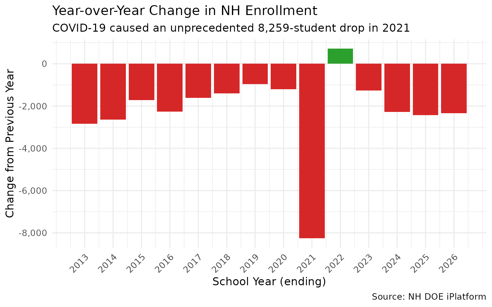

### 3. Charter schools grew from 0.6% to 3.9% of enrollment

While total enrollment shrank, charter schools quintupled their share —
from 9 charters with 1,090 students in 2012 to 35 charters with 6,242 in
2026.

``` r
charter_names <- enr |>
  filter(is_district, end_year == 2026) |>
  filter(grepl("Charter|Chartered", district_name, ignore.case = TRUE)) |>
  distinct(district_name) |>
  pull()

charter_trend <- enr |>
  filter(is_district, subgroup == "total_enrollment", grade_level == "TOTAL",
         district_name %in% charter_names) |>
  group_by(end_year) |>
  summarize(
    n_charter = sum(n_students, na.rm = TRUE),
    n_charters = n(),
    .groups = "drop"
  )

state_total <- enr |>
  filter(is_state, subgroup == "total_enrollment", grade_level == "TOTAL") |>
  select(end_year, state_total = n_students)

charter_pct <- charter_trend |>
  left_join(state_total, by = "end_year") |>
  mutate(pct = round(n_charter / state_total * 100, 1))

stopifnot(nrow(charter_pct) > 0)
charter_pct
#> # A tibble: 15 × 5
#>    end_year n_charter n_charters state_total   pct
#>       <int>     <int>      <int>       <int> <dbl>
#>  1     2012      1090          9      190805   0.6
#>  2     2013      1640         14      187962   0.9
#>  3     2014      1978         15      185320   1.1
#>  4     2015      2426         19      183604   1.3
#>  5     2016      2890         21      181339   1.6
#>  6     2017      3297         21      179734   1.8
#>  7     2018      3421         21      178328   1.9
#>  8     2019      3752         23      177365   2.1
#>  9     2020      3993         23      176168   2.3
#> 10     2021      4336         24      167909   2.6
#> 11     2022      4756         25      168620   2.8
#> 12     2023      5211         27      167357   3.1
#> 13     2024      5460         29      165082   3.3
#> 14     2025      5938         31      162660   3.7
#> 15     2026      6242         35      160322   3.9
```

``` r
ggplot(charter_pct, aes(x = end_year)) +
  geom_col(aes(y = n_charter), fill = "#ff7f0e", alpha = 0.8) +
  geom_text(aes(y = n_charter, label = paste0(pct, "%")),
            vjust = -0.5, size = 3.5) +
  scale_x_continuous(breaks = seq(2012, 2026, 2)) +
  scale_y_continuous(labels = scales::comma) +
  labs(
    title = "NH Charter School Enrollment, 2012-2026",
    subtitle = "From 9 charters (0.6%) to 35 charters (3.9%) of total enrollment",
    x = "School Year (ending)",
    y = "Charter School Students",
    caption = "Source: NH DOE iPlatform"
  ) +
  theme_minimal(base_size = 13)
```

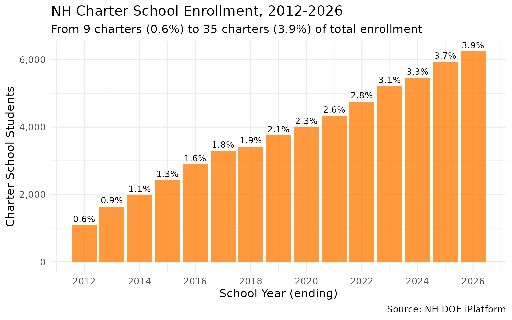

## District deep dives

### 4. Manchester lost nearly a quarter of its students

New Hampshire’s largest city saw enrollment drop from 15,536 to 11,712 —
a loss of 3,824 students (24.6%) while maintaining 20 schools.

``` r
big2 <- enr |>
  filter(is_district, subgroup == "total_enrollment", grade_level == "TOTAL",
         district_name %in% c("Manchester", "Nashua")) |>
  select(end_year, district_name, n_students) |>
  arrange(end_year, district_name)

stopifnot(nrow(big2) > 0)
big2 |>
  filter(end_year %in% c(2012, 2018, 2026)) |>
  pivot_wider(names_from = district_name, values_from = n_students)
#> # A tibble: 3 × 3
#>   end_year Manchester Nashua
#>      <int>      <int>  <int>
#> 1     2012      15536  11894
#> 2     2018      13621  11075
#> 3     2026      11712   9501
```

``` r
ggplot(big2, aes(x = end_year, y = n_students, color = district_name)) +
  geom_line(linewidth = 1.1) +
  geom_point(size = 2) +
  scale_y_continuous(labels = scales::comma) +
  scale_x_continuous(breaks = seq(2012, 2026, 2)) +
  scale_color_manual(values = c("Manchester" = "#1f77b4", "Nashua" = "#d62728")) +
  labs(
    title = "Manchester vs Nashua: NH's Two Largest Districts",
    subtitle = "Both declining, but Manchester lost 3,824 students (-24.6%)",
    x = "School Year (ending)",
    y = "Total Students",
    color = "District",
    caption = "Source: NH DOE iPlatform"
  ) +
  theme_minimal(base_size = 13)
```

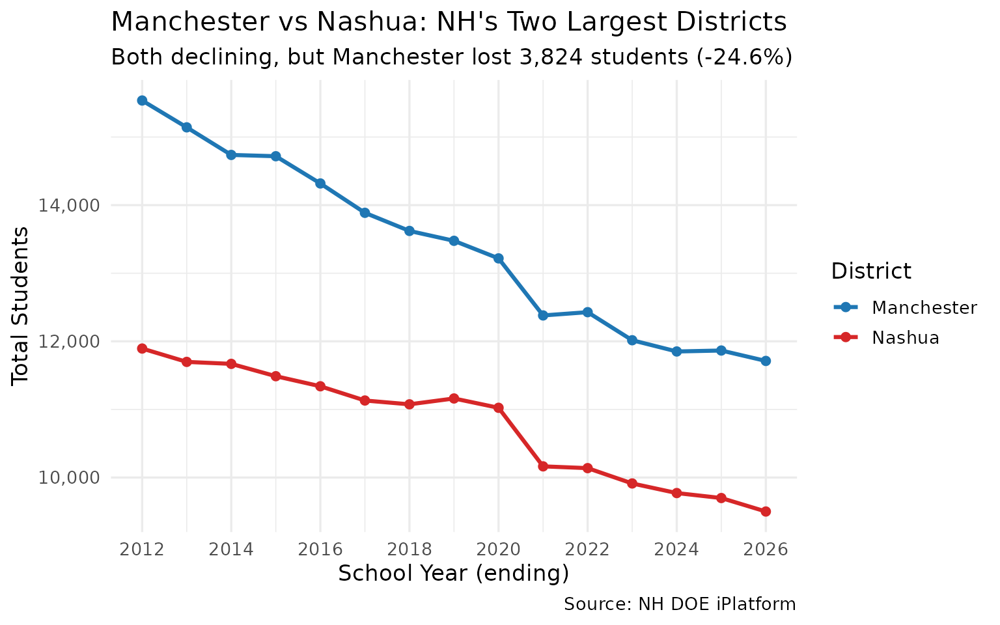

### 5. Errol has 12 students — the state’s tiniest district

New Hampshire has dozens of districts with fewer than 100 students. The
smallest, Errol, has just 12 — smaller than most college seminar
classes.

``` r
smallest <- enr |>
  filter(is_district, subgroup == "total_enrollment", grade_level == "TOTAL",
         end_year == 2026) |>
  select(district_name, sau, sau_name, n_students) |>
  arrange(n_students) |>
  head(10)

stopifnot(nrow(smallest) > 0)
smallest
#>                                 district_name sau
#> 1                                       Errol  20
#> 2                                     Landaff  35
#> 3  North Star Academy Chartered Public School 406
#> 4                                     Jackson   9
#> 5                                     Croydon  99
#> 6                                       Stark  58
#> 7                                      Marlow  29
#> 8                          CSI Charter School 410
#> 9   NH Career Academy Chartered Public School 421
#> 10                          Waterville Valley  48
#>                                      sau_name n_students
#> 1                                      Gorham         12
#> 2                              SAU #35 Office         15
#> 3  North Star Academy Chartered Public School         17
#> 4                                      Conway         26
#> 5                                     Croydon         28
#> 6                              Northumberland         30
#> 7                                       Keene         32
#> 8                          CSI Charter School         32
#> 9   NH Career Academy Chartered Public School         32
#> 10                                   Plymouth         34
```

``` r
smallest_plot <- smallest |>
  mutate(district_name = forcats::fct_reorder(district_name, n_students))

ggplot(smallest_plot, aes(x = district_name, y = n_students)) +
  geom_col(fill = "#2ca02c") +
  geom_text(aes(label = n_students), hjust = -0.3, size = 3.5) +
  coord_flip() +
  labs(
    title = "NH's 10 Smallest School Districts (2025-26)",
    subtitle = "Errol has just 12 students enrolled",
    x = NULL,
    y = "Total Students",
    caption = "Source: NH DOE iPlatform"
  ) +
  theme_minimal(base_size = 13)
```

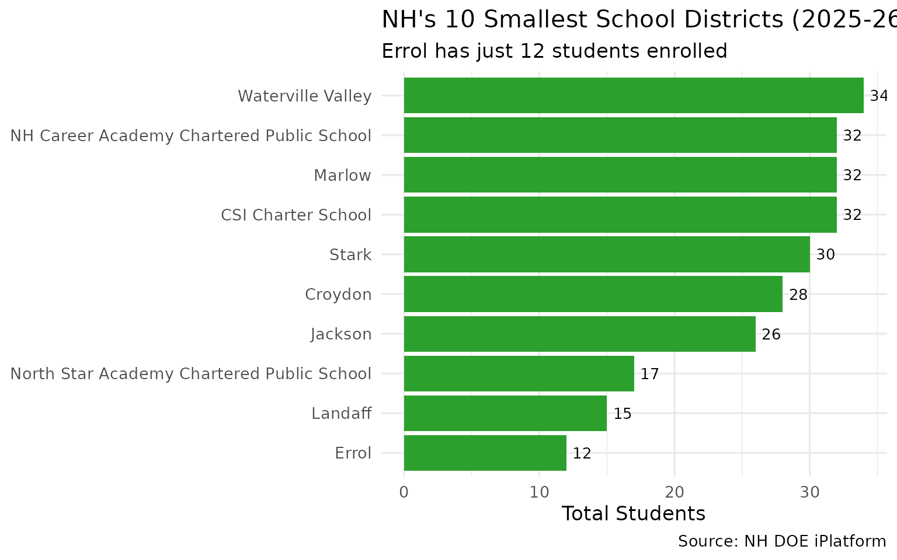

### 6. Virtual Learning Academy grew 756% — the biggest gainer

While most districts shrank, Virtual Learning Academy Charter School
grew from 63 students in 2012 to 539 in 2026 — a 756% increase.

``` r
changes <- enr |>
  filter(is_district, subgroup == "total_enrollment", grade_level == "TOTAL",
         end_year %in% c(2012, 2026)) |>
  select(end_year, district_name, n_students) |>
  pivot_wider(names_from = end_year, values_from = n_students,
              names_prefix = "y") |>
  filter(!is.na(y2012), !is.na(y2026)) |>
  mutate(
    change = y2026 - y2012,
    pct_change = round((y2026 / y2012 - 1) * 100, 1)
  )

stopifnot(nrow(changes) > 0)
cat("Top 5 gainers:\n")
#> Top 5 gainers:
changes |> arrange(desc(pct_change)) |> head(5)
#> # A tibble: 5 × 5
#>   district_name                                 y2012 y2026 change pct_change
#>   <chr>                                         <int> <int>  <int>      <dbl>
#> 1 Virtual Learning Academy Charter School          63   539    476      756. 
#> 2 Academy for Science and Design Charter School   285   671    386      135. 
#> 3 Nelson                                           25    58     33      132  
#> 4 Strong Foundations Charter School               172   336    164       95.3
#> 5 Ledyard Charter School                           29    49     20       69
```

``` r
top_gainers <- changes |>
  arrange(desc(change)) |>
  head(8) |>
  mutate(district_name = forcats::fct_reorder(district_name, change))

ggplot(top_gainers, aes(x = district_name, y = change, fill = change > 0)) +
  geom_col() +
  geom_text(aes(label = paste0(ifelse(change > 0, "+", ""), change)),
            hjust = -0.1, size = 3.5) +
  coord_flip() +
  scale_fill_manual(values = c("TRUE" = "#2ca02c"), guide = "none") +
  labs(
    title = "Districts That Grew Despite Statewide Decline",
    subtitle = "2012 to 2026, absolute student change",
    x = NULL,
    y = "Change in Students",
    caption = "Source: NH DOE iPlatform"
  ) +
  theme_minimal(base_size = 13)
```

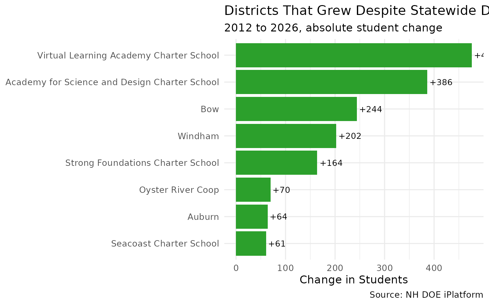

### 7. Top 5 losers account for 9,481 lost students

The five largest districts — Manchester, Nashua, Hudson, Concord, and
Londonderry — together lost 9,481 students, nearly a third of the
statewide decline.

``` r
top_losers <- changes |>
  arrange(change) |>
  head(5)

stopifnot(nrow(top_losers) == 5)
top_losers
#> # A tibble: 5 × 5
#>   district_name y2012 y2026 change pct_change
#>   <chr>         <int> <int>  <int>      <dbl>
#> 1 Manchester    15536 11712  -3824      -24.6
#> 2 Nashua        11894  9501  -2393      -20.1
#> 3 Hudson         4052  2875  -1177      -29  
#> 4 Concord        4842  3755  -1087      -22.4
#> 5 Londonderry    4847  3847  -1000      -20.6
```

``` r
losers_trend <- enr |>
  filter(is_district, subgroup == "total_enrollment", grade_level == "TOTAL",
         district_name %in% top_losers$district_name) |>
  select(end_year, district_name, n_students)

ggplot(losers_trend, aes(x = end_year, y = n_students, color = district_name)) +
  geom_line(linewidth = 1) +
  geom_point(size = 1.5) +
  scale_y_continuous(labels = scales::comma) +
  scale_x_continuous(breaks = seq(2012, 2026, 2)) +
  labs(
    title = "NH's 5 Biggest Losers: Enrollment Since 2012",
    subtitle = "Combined loss of 9,481 students (31% of statewide decline)",
    x = "School Year (ending)",
    y = "Total Students",
    color = "District",
    caption = "Source: NH DOE iPlatform"
  ) +
  theme_minimal(base_size = 13)
```

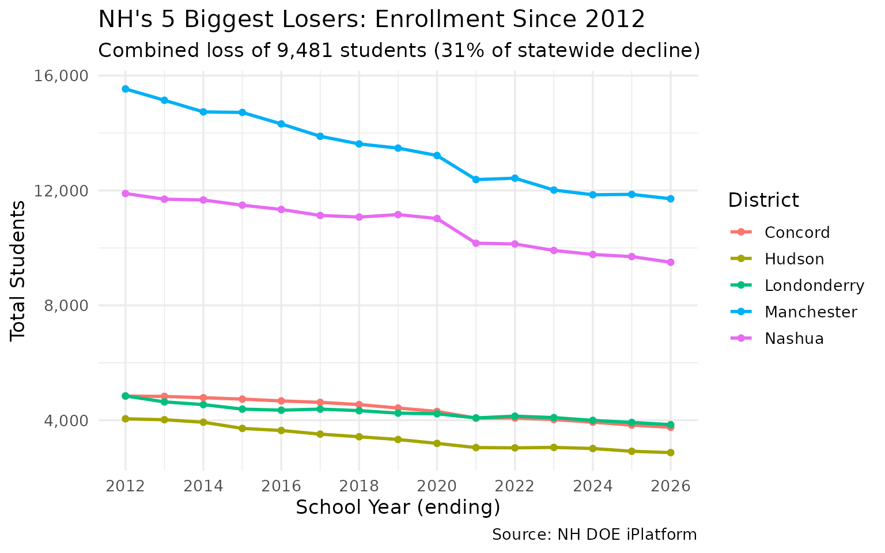

## Grade-level patterns

### 8. Grade 12 consistently outnumbers Grade 1

Every year since 2012, more students graduate from 12th grade than enter
1st grade — a demographic signature of sustained population decline.

``` r
pipeline <- enr |>
  filter(is_campus, subgroup == "total_enrollment",
         grade_level %in% c("01", "12")) |>
  group_by(end_year, grade_level) |>
  summarize(n = sum(n_students, na.rm = TRUE), .groups = "drop") |>
  pivot_wider(names_from = grade_level, values_from = n) |>
  rename(grade_01 = `01`, grade_12 = `12`) |>
  mutate(ratio = round(grade_12 / grade_01, 2))

stopifnot(nrow(pipeline) > 0)
pipeline
#> # A tibble: 15 × 4
#>    end_year grade_01 grade_12 ratio
#>       <int>    <int>    <int> <dbl>
#>  1     2012    13595    14673  1.08
#>  2     2013    13609    14404  1.06
#>  3     2014    13461    13962  1.04
#>  4     2015    13157    13671  1.04
#>  5     2016    12898    13752  1.07
#>  6     2017    12377    13338  1.08
#>  7     2018    12678    13235  1.04
#>  8     2019    12351    13080  1.06
#>  9     2020    12501    13172  1.05
#> 10     2021    11675    13114  1.12
#> 11     2022    11754    12867  1.09
#> 12     2023    12099    12471  1.03
#> 13     2024    11687    12502  1.07
#> 14     2025    11278    12493  1.11
#> 15     2026    11169    12388  1.11
```

``` r
pipeline_long <- pipeline |>
  pivot_longer(cols = c(grade_01, grade_12), names_to = "grade",
               values_to = "students") |>
  mutate(grade = ifelse(grade == "grade_01", "Grade 1", "Grade 12"))

ggplot(pipeline_long, aes(x = end_year, y = students, color = grade)) +
  geom_line(linewidth = 1.1) +
  geom_point(size = 2) +
  scale_y_continuous(labels = scales::comma) +
  scale_x_continuous(breaks = seq(2012, 2026, 2)) +
  scale_color_manual(values = c("Grade 1" = "#2ca02c", "Grade 12" = "#9467bd")) +
  labs(
    title = "Grade 1 vs Grade 12 Enrollment",
    subtitle = "More students exit than enter NH public schools each year",
    x = "School Year (ending)",
    y = "Students",
    color = NULL,
    caption = "Source: NH DOE iPlatform (school-level data)"
  ) +
  theme_minimal(base_size = 13)
```

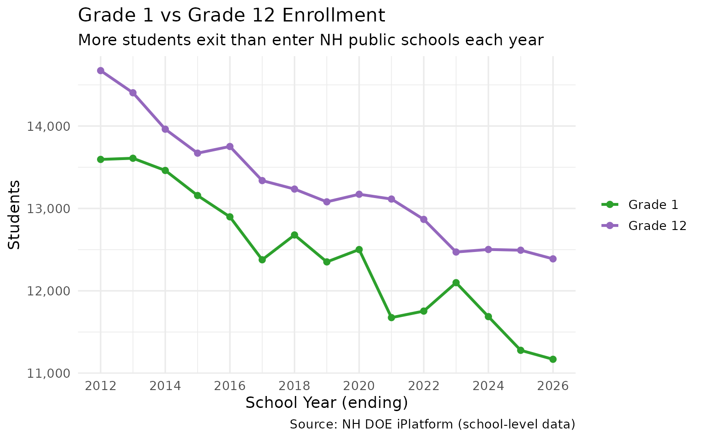

### 9. PreK enrollment grew 39% while everything else shrank

PreK enrollment rose from 3,165 to 4,395 — a 39% increase — even as
overall enrollment fell 16%. The COVID crash in 2021 hit PreK hardest
(37% drop) but it fully recovered by 2023.

``` r
prek <- enr |>
  filter(is_state, subgroup == "total_enrollment", grade_level == "PK") |>
  select(end_year, n_students) |>
  arrange(end_year)

stopifnot(nrow(prek) > 0)
prek
#>    end_year n_students
#> 1      2012       3165
#> 2      2013       3200
#> 3      2014       3401
#> 4      2015       3557
#> 5      2016       3670
#> 6      2017       3894
#> 7      2018       3876
#> 8      2019       4192
#> 9      2020       4518
#> 10     2021       2908
#> 11     2022       3848
#> 12     2023       4385
#> 13     2024       4440
#> 14     2025       4385
#> 15     2026       4395
```

``` r
ggplot(prek, aes(x = end_year, y = n_students)) +
  geom_line(linewidth = 1.2, color = "#ff7f0e") +
  geom_point(size = 2, color = "#ff7f0e") +
  scale_y_continuous(labels = scales::comma) +
  scale_x_continuous(breaks = seq(2012, 2026, 2)) +
  labs(
    title = "PreK Enrollment Bucked the Statewide Decline",
    subtitle = "Grew 39% (3,165 to 4,395) while total enrollment fell 16%",
    x = "School Year (ending)",
    y = "PreK Students",
    caption = "Source: NH DOE iPlatform"
  ) +
  theme_minimal(base_size = 13)
```

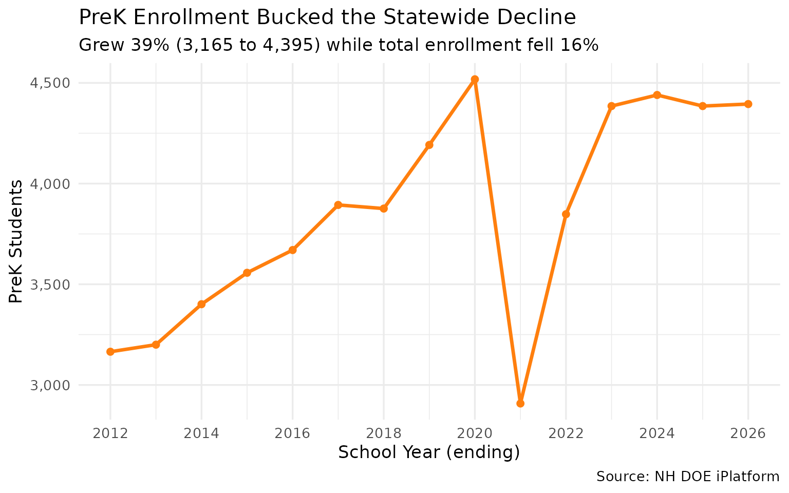

### 10. Kindergarten lost 1,177 students since 2012

Kindergarten enrollment dropped from 11,904 to 10,727 — a 10% decline
that signals continued enrollment losses ahead.

``` r
k_trend <- enr |>
  filter(is_campus, subgroup == "total_enrollment", grade_level == "K") |>
  group_by(end_year) |>
  summarize(n_students = sum(n_students, na.rm = TRUE), .groups = "drop")

stopifnot(nrow(k_trend) > 0)
k_trend
#> # A tibble: 15 × 2
#>    end_year n_students
#>       <int>      <int>
#>  1     2012      11904
#>  2     2013      11888
#>  3     2014      11602
#>  4     2015      11570
#>  5     2016      11187
#>  6     2017      11422
#>  7     2018      11415
#>  8     2019      11691
#>  9     2020      11689
#> 10     2021      10111
#> 11     2022      11212
#> 12     2023      11074
#> 13     2024      10893
#> 14     2025      10871
#> 15     2026      10727
```

``` r
ggplot(k_trend, aes(x = end_year, y = n_students)) +
  geom_line(linewidth = 1.2, color = "#17becf") +
  geom_point(size = 2, color = "#17becf") +
  scale_y_continuous(labels = scales::comma) +
  scale_x_continuous(breaks = seq(2012, 2026, 2)) +
  labs(
    title = "Kindergarten Enrollment, 2012-2026",
    subtitle = "Down 10% — each incoming class is smaller than the last",
    x = "School Year (ending)",
    y = "Kindergarten Students",
    caption = "Source: NH DOE iPlatform (school-level data)"
  ) +
  theme_minimal(base_size = 13)
```

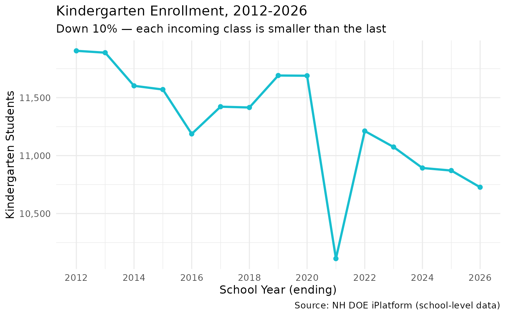

## Structural patterns

### 11. 111 one-school districts vs Manchester’s 20

Over half of NH’s districts have just one school. Meanwhile Manchester
operates 20 — nearly as many as the bottom 40 districts combined.

``` r
schools_per <- enr |>
  filter(is_campus, subgroup == "total_enrollment", grade_level == "TOTAL",
         end_year == 2026) |>
  group_by(district_name) |>
  summarize(n_schools = n(), .groups = "drop") |>
  arrange(desc(n_schools))

stopifnot(nrow(schools_per) > 0)
cat("Districts by school count:\n")
#> Districts by school count:
schools_per |>
  mutate(category = case_when(
    n_schools == 1 ~ "1 school",
    n_schools <= 3 ~ "2-3 schools",
    n_schools <= 10 ~ "4-10 schools",
    TRUE ~ "11+ schools"
  )) |>
  count(category)
#> # A tibble: 4 × 2
#>   category         n
#>   <chr>        <int>
#> 1 1 school       111
#> 2 11+ schools      4
#> 3 2-3 schools     51
#> 4 4-10 schools    37
```

``` r
schools_hist <- schools_per |>
  mutate(bucket = cut(n_schools, breaks = c(0, 1, 3, 5, 10, 20),
                      labels = c("1", "2-3", "4-5", "6-10", "11-20")))

ggplot(schools_hist, aes(x = bucket)) +
  geom_bar(fill = "#1f77b4") +
  geom_text(stat = "count", aes(label = after_stat(count)), vjust = -0.5) +
  labs(
    title = "How Many Schools Do NH Districts Operate? (2025-26)",
    subtitle = "111 districts have just one school; Manchester has 20",
    x = "Number of Schools",
    y = "Number of Districts",
    caption = "Source: NH DOE iPlatform"
  ) +
  theme_minimal(base_size = 13)
```

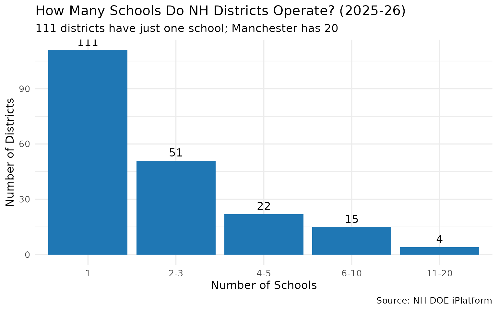

### 12. The SAU system: one administrator, multiple districts

New Hampshire’s School Administrative Units (SAUs) are a unique feature.
Plymouth SAU \#48 covers 8 districts, allowing tiny towns to share
administrative costs.

``` r
sau_multi <- enr |>
  filter(is_district, subgroup == "total_enrollment", grade_level == "TOTAL",
         end_year == 2026) |>
  group_by(sau, sau_name) |>
  summarize(
    n_districts = n(),
    total_students = sum(n_students, na.rm = TRUE),
    districts = paste(district_name, collapse = ", "),
    .groups = "drop"
  ) |>
  arrange(desc(n_districts))

stopifnot(nrow(sau_multi) > 0)
sau_multi |> head(8)
#> # A tibble: 8 × 5
#>   sau   sau_name              n_districts total_students districts              
#>   <chr> <chr>                       <int>          <int> <chr>                  
#> 1 48    Plymouth                        8           1753 Campton, Holderness, P…
#> 2 16    Exeter                          7           4147 Brentwood, East Kingst…
#> 3 29    Keene                           7           3583 Chesterfield, Harrisvi…
#> 4 21    Winnacunnet                     5           2044 Hampton Falls, North H…
#> 5 35    SAU #35 Office                  5            726 Bethlehem, Lafayette R…
#> 6 53    Pembroke                        5           2695 Allenstown, Chichester…
#> 7 23    Haverhill Cooperative           4            771 Bath, Haverhill Cooper…
#> 8 24    Henniker                        4           1869 Henniker, John Stark R…
```

``` r
sau_top <- sau_multi |>
  head(10) |>
  mutate(sau_label = paste0("SAU ", sau, " (", sau_name, ")")) |>
  mutate(sau_label = forcats::fct_reorder(sau_label, n_districts))

ggplot(sau_top, aes(x = sau_label, y = n_districts)) +
  geom_col(fill = "#9467bd") +
  geom_text(aes(label = paste0(n_districts, " districts\n(",
                                scales::comma(total_students), " students)")),
            hjust = -0.05, size = 3) +
  coord_flip() +
  labs(
    title = "SAUs with the Most Districts (2025-26)",
    subtitle = "Plymouth SAU #48 covers 8 independent districts",
    x = NULL,
    y = "Number of Districts",
    caption = "Source: NH DOE iPlatform"
  ) +
  theme_minimal(base_size = 13) +
  theme(plot.margin = margin(5.5, 40, 5.5, 5.5))
```

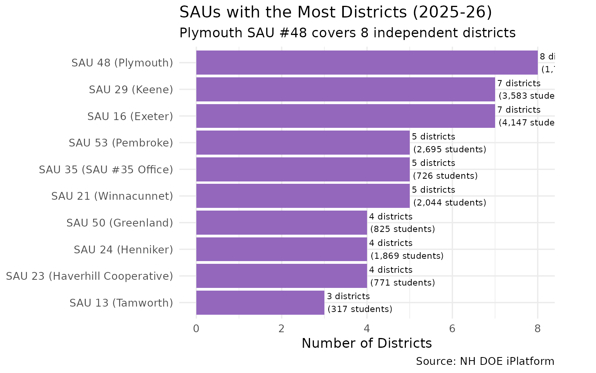

### 13. North Country lost 26% of its students

The remote northern districts (Coos County area) saw enrollment drop
from 2,526 to 1,859 — a 26% decline, steeper than the statewide average.

``` r
north_country <- c("Berlin", "Gorham", "Milan", "Errol", "Pittsburg",
                    "Colebrook", "Stark", "Stratford", "Stewartstown",
                    "Northumberland", "Lancaster", "Whitefield", "Dalton")

nc_trend <- enr |>
  filter(is_district, subgroup == "total_enrollment", grade_level == "TOTAL",
         district_name %in% north_country) |>
  group_by(end_year) |>
  summarize(
    n_students = sum(n_students, na.rm = TRUE),
    n_districts = n(),
    .groups = "drop"
  )

stopifnot(nrow(nc_trend) > 0)
nc_trend
#> # A tibble: 15 × 3
#>    end_year n_students n_districts
#>       <int>      <int>       <int>
#>  1     2012       2526           9
#>  2     2013       2522           9
#>  3     2014       2466           9
#>  4     2015       2389           9
#>  5     2016       2300           9
#>  6     2017       2277           9
#>  7     2018       2228           9
#>  8     2019       2181           9
#>  9     2020       2153           9
#> 10     2021       2053           9
#> 11     2022       2038           9
#> 12     2023       2009           9
#> 13     2024       1959           9
#> 14     2025       1907           9
#> 15     2026       1859           9
```

``` r
ggplot(nc_trend, aes(x = end_year, y = n_students)) +
  geom_line(linewidth = 1.2, color = "#d62728") +
  geom_point(size = 2, color = "#d62728") +
  scale_y_continuous(labels = scales::comma) +
  scale_x_continuous(breaks = seq(2012, 2026, 2)) +
  labs(
    title = "North Country Enrollment: Faster Decline Than the State",
    subtitle = "Coos County area districts lost 26% of students (2,526 to 1,859)",
    x = "School Year (ending)",
    y = "Total Students",
    caption = "Source: NH DOE iPlatform"
  ) +
  theme_minimal(base_size = 13)
```

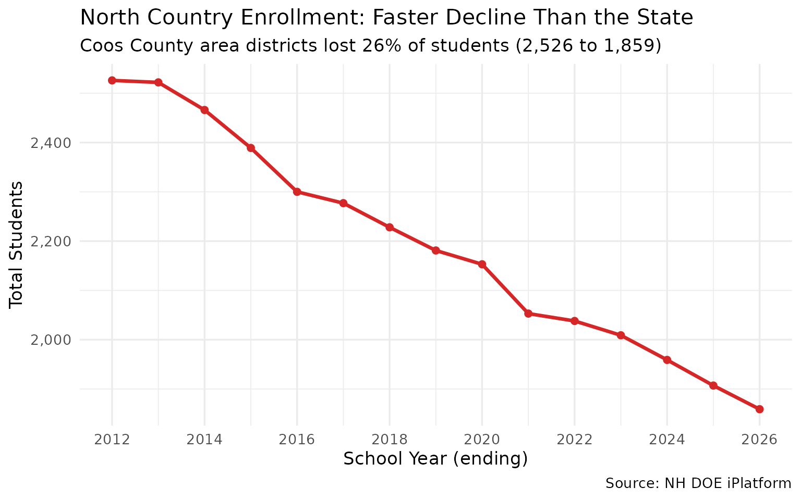

### 14. Southern NH’s Boston corridor also losing students

Even districts near the Massachusetts border — traditionally NH’s growth
engine — are declining. Salem, Windham, Londonderry, and Hudson together
lost 3,432 students.

``` r
south_nh <- c("Salem", "Windham", "Londonderry", "Derry", "Hudson",
              "Pelham", "Hampstead", "Atkinson", "Plaistow", "Sandown")

snh_trend <- enr |>
  filter(is_district, subgroup == "total_enrollment", grade_level == "TOTAL",
         district_name %in% south_nh) |>
  group_by(end_year) |>
  summarize(n_students = sum(n_students, na.rm = TRUE), .groups = "drop")

stopifnot(nrow(snh_trend) > 0)
snh_trend |> filter(end_year %in% c(2012, 2020, 2026))
#> # A tibble: 3 × 2
#>   end_year n_students
#>      <int>      <int>
#> 1     2012      18887
#> 2     2020      16638
#> 3     2026      15455
```

``` r
# Compare Southern NH vs State (indexed to 2012 = 100)
state_idx <- state_trend |>
  mutate(index = round(n_students / first(n_students) * 100, 1),
         region = "Statewide")

snh_idx <- snh_trend |>
  mutate(index = round(n_students / first(n_students) * 100, 1),
         region = "Southern NH (Boston corridor)")

nc_idx <- nc_trend |>
  mutate(index = round(n_students / first(n_students) * 100, 1),
         region = "North Country")

combined <- bind_rows(
  state_idx |> select(end_year, index, region),
  snh_idx |> select(end_year, index, region),
  nc_idx |> select(end_year, index, region)
)

ggplot(combined, aes(x = end_year, y = index, color = region)) +
  geom_line(linewidth = 1.1) +
  geom_point(size = 2) +
  geom_hline(yintercept = 100, linetype = "dashed", alpha = 0.5) +
  scale_x_continuous(breaks = seq(2012, 2026, 2)) +
  labs(
    title = "Regional Enrollment Decline (Indexed to 2012 = 100)",
    subtitle = "North Country declining fastest, but even Southern NH is down",
    x = "School Year (ending)",
    y = "Index (2012 = 100)",
    color = NULL,
    caption = "Source: NH DOE iPlatform"
  ) +
  theme_minimal(base_size = 13) +
  theme(legend.position = "bottom")
```

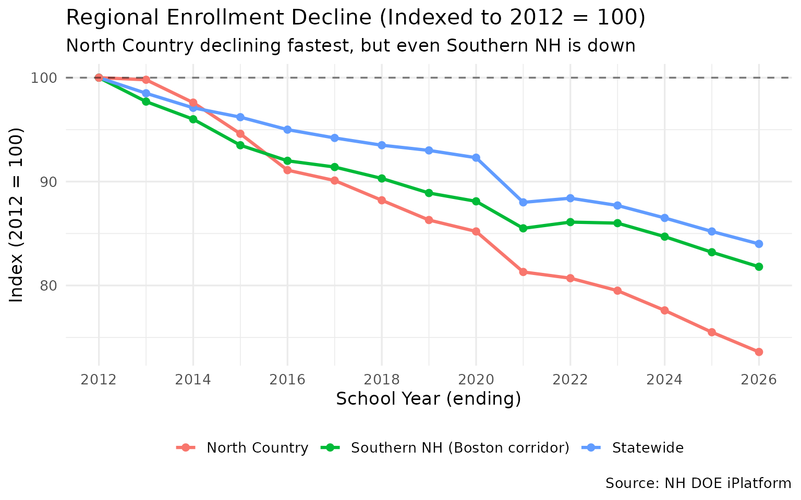

### 15. The grade pyramid: where NH’s students are

The 2025-26 grade distribution shows that upper grades have more
students than lower grades — confirming the downward demographic trend.
Grade 9 has the most students (13,156), while Grade 1 has the fewest
K-12 (11,169).

``` r
grade_dist <- enr |>
  filter(is_campus, subgroup == "total_enrollment",
         end_year == 2026,
         !grade_level %in% c("TOTAL", "ELEM", "MIDDLE", "HIGH")) |>
  group_by(grade_level) |>
  summarize(n_students = sum(n_students, na.rm = TRUE), .groups = "drop") |>
  arrange(grade_level)

stopifnot(nrow(grade_dist) > 0)
grade_dist
#> # A tibble: 15 × 2
#>    grade_level n_students
#>    <chr>            <int>
#>  1 01               11169
#>  2 02               11331
#>  3 03               11677
#>  4 04               12160
#>  5 05               11983
#>  6 06               12095
#>  7 07               12311
#>  8 08               12256
#>  9 09               13156
#> 10 10               12213
#> 11 11               12339
#> 12 12               12388
#> 13 K                10727
#> 14 PG                  73
#> 15 PK                4395
```

``` r
grade_order <- c("PK", "K", "01", "02", "03", "04", "05", "06",
                 "07", "08", "09", "10", "11", "12", "PG")
grade_labels <- c("PreK", "K", "1", "2", "3", "4", "5", "6",
                  "7", "8", "9", "10", "11", "12", "PG")

grade_plot <- grade_dist |>
  mutate(
    grade_level = factor(grade_level, levels = grade_order, labels = grade_labels)
  ) |>
  filter(!is.na(grade_level))

ggplot(grade_plot, aes(x = grade_level, y = n_students)) +
  geom_col(fill = "#1f77b4") +
  geom_text(aes(label = scales::comma(n_students)), vjust = -0.3, size = 3) +
  scale_y_continuous(labels = scales::comma) +
  labs(
    title = "NH Enrollment by Grade Level (2025-26)",
    subtitle = "Upper grades larger than lower — demographic contraction in real time",
    x = "Grade",
    y = "Students",
    caption = "Source: NH DOE iPlatform (school-level data)"
  ) +
  theme_minimal(base_size = 13)
```

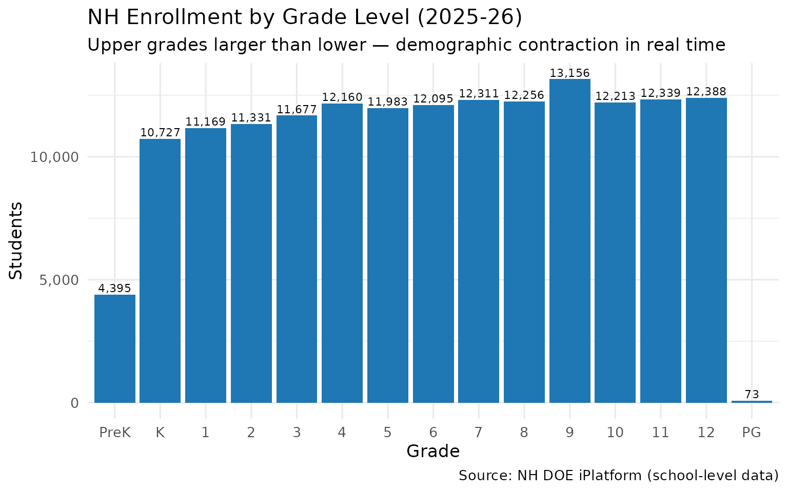

## Session Info

``` r
sessionInfo()
#> R version 4.5.2 (2025-10-31)
#> Platform: x86_64-pc-linux-gnu
#> Running under: Ubuntu 24.04.3 LTS
#> 
#> Matrix products: default
#> BLAS:   /usr/lib/x86_64-linux-gnu/openblas-pthread/libblas.so.3 
#> LAPACK: /usr/lib/x86_64-linux-gnu/openblas-pthread/libopenblasp-r0.3.26.so;  LAPACK version 3.12.0
#> 
#> locale:
#>  [1] LC_CTYPE=C.UTF-8       LC_NUMERIC=C           LC_TIME=C.UTF-8       
#>  [4] LC_COLLATE=C.UTF-8     LC_MONETARY=C.UTF-8    LC_MESSAGES=C.UTF-8   
#>  [7] LC_PAPER=C.UTF-8       LC_NAME=C              LC_ADDRESS=C          
#> [10] LC_TELEPHONE=C         LC_MEASUREMENT=C.UTF-8 LC_IDENTIFICATION=C   
#> 
#> time zone: UTC
#> tzcode source: system (glibc)
#> 
#> attached base packages:
#> [1] stats     graphics  grDevices utils     datasets  methods   base     
#> 
#> other attached packages:
#> [1] tidyr_1.3.2        ggplot2_4.0.2      dplyr_1.2.0        nhschooldata_0.2.0
#> [5] testthat_3.3.2    
#> 
#> loaded via a namespace (and not attached):
#>  [1] gtable_0.3.6       jsonlite_2.0.0     compiler_4.5.2     brio_1.1.5        
#>  [5] tidyselect_1.2.1   jquerylib_0.1.4    systemfonts_1.3.1  scales_1.4.0      
#>  [9] textshaping_1.0.4  yaml_2.3.12        fastmap_1.2.0      R6_2.6.1          
#> [13] labeling_0.4.3     generics_0.1.4     knitr_1.51         forcats_1.0.1     
#> [17] tibble_3.3.1       desc_1.4.3         bslib_0.10.0       pillar_1.11.1     
#> [21] RColorBrewer_1.1-3 rlang_1.1.7        utf8_1.2.6         cachem_1.1.0      
#> [25] xfun_0.56          fs_1.6.6           sass_0.4.10        S7_0.2.1          
#> [29] cli_3.6.5          withr_3.0.2        pkgdown_2.2.0      magrittr_2.0.4    
#> [33] digest_0.6.39      grid_4.5.2         rappdirs_0.3.4     lifecycle_1.0.5   
#> [37] vctrs_0.7.1        evaluate_1.0.5     glue_1.8.0         farver_2.1.2      
#> [41] codetools_0.2-20   ragg_1.5.0         purrr_1.2.1        rmarkdown_2.30    
#> [45] tools_4.5.2        pkgconfig_2.0.3    htmltools_0.5.9
```
